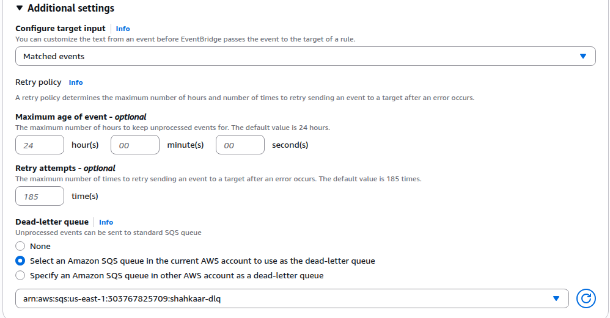

# EventBridge Rule for S3 Events → Lambda
| Description         | Link                                                                   |
|---------------------|------------------------------------------------------------------------|
| Using Event Bridge  | https://docs.aws.amazon.com/AmazonS3/latest/userguide/EventBridge.html |
| Message Struction   | https://docs.aws.amazon.com/AmazonS3/latest/userguide/ev-events.html   |


## Overview

This document describes how to create an **Amazon EventBridge rule** that listens for **Amazon S3 object events** and triggers an **AWS Lambda function**.

---

# Prerequisites

* An existing **S3 bucket**
* **EventBridge notifications enabled** on the S3 bucket
* An existing **Lambda function**
* Appropriate IAM permissions to manage EventBridge and Lambda

---

---

# Create EventBridge Rule

## Using AWS Console

1. Navigate to **EventBridge**
2. Select **Rules**
3. Click **Create rule**

### Rule Configuration

* **Name:** `shahkaar-object-event-sds-second-bucket`
* **Event bus:** `default`
* **Rule type:** `Rule with an event pattern`

---

# Define Event Pattern

Example pattern for **object creation events**:

```json
{
  "source": ["aws.s3"],
  "detail-type": ["Object Created", "Object Deleted"],
  "detail": {
    "bucket": {
      "name": ["sds-second"]
    }
  }
}
```

Optional filters can be added for:

* object prefix
* object suffix
* specific event types

---

# Configure Target

Select the target service:

* **Target type:** AWS service
* **Select a target:** Lambda function
* **Target Location:** Target in this account
* **Function:** `HelloLambdaQuarkus`
 
In Permissions section set following properties
* **Use execution role:** Select this check box
* **Execution role:** Use existing role
* **Role Name:** shahkaar-lambda
  
* **Optional setting:** Use a Dead-letter queue (helps debugging issues). Sample setting below.    
<details>
<summary>Sample Dead-letter Q</summary>



</details>

EventBridge will invoke the Lambda function when matching S3 events occur.

---

# Example Event Received by Lambda

Example EventBridge payload:

```json
{
  "version": "0",
  "id": "06867d52-424c-a01f-902e-12988b843c28",
  "detail-type": "Object Deleted",
  "source": "aws.s3",
  "account": "303767825709",
  "time": "2026-03-12T02:07:57Z",
  "region": "us-east-1",
  "resources": [
    "arn:aws:s3:::sds-second"
  ],
  "detail": {
    "version": "0",
    "bucket": {
      "name": "sds-second"
    },
    "object": {
      "key": "Screenshot from 2026-03-11 18-23-57.png",
      "sequencer": "0069B21FFD0745EE4E"
    },
    "request-id": "5NV30C3NV8BJERFV",
    "requester": "303767825709",
    "source-ip-address": "76.17.146.230",
    "reason": "DeleteObject",
    "deletion-type": "Permanently Deleted"
  }
}
```

---

# Monitoring

Monitor the system using:

* **CloudWatch Logs** for Lambda execution
* **EventBridge metrics** for rule invocation
* **AWS CloudTrail** for event auditing
